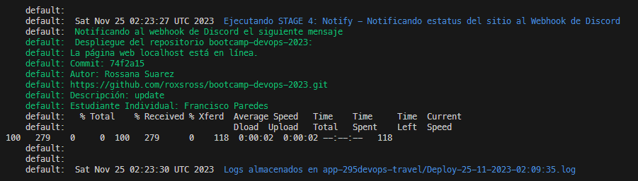

# bootcamp-devops-2023-frannkx-ejer1
Repositorio de Francisco Paredes para solucion de ejercicio 1 del Bootcampt Devops de roxsross

## Requerimientos tecnicos

### Hardware: 

* CPU > 2 vCPU
* RAM >= 4GB 
* HD >= 50GB Disponible

### Software
* Virtualbox (Version 7.0 Recomendado)
* Vagrant (Version 2.4.0 Recomendado)

## Ajustes antes de instalación

En el archivo "frannkx-deploy.sh se deben modificar las siguientes variables de acuerdo a su necesidad:

* DISCORD: Colocar su Webhook de Discrord
* DB_USER: Usuario deseado para la base de datos
* DB_PASS: Password deseado para la base de datos
* DB_HOST: IP o URL de nodo de base de datos (modificar solo si la BD esta fuera del nodo)

Luego de tener instalado el software necesario y confirmar que los requerimientos tecnicos estan cubiertos aplicar desde el CMD o Terminal de linux aplicar los siguientes pasos:

1. Ir a la carpeta Vagrant
```cd vagrant```

2. Levantar el servidor
```vagrant up```

3. Visualizar como avanza la implmenentación de la maquina virtual y el despliegue de la aplicación.

4. Si el depliegue salio de manera correcta visualizara un mensaje indicando lo siguiente:

default:  Notificando al webhook de Discord el siguiente mensaje
default:  Despliegue del repositorio bootcamp-devops-2023:
default: La página web localhost está en línea.
default: Commit: 74f2a15
default: Autor: Rossana Suarez
default: https://github.com/roxsross/bootcamp-devops-2023.git
default: Descripción: update
default: Estudiante Individual: Francisco Paredes

Logs almacenados en app-295devops-travel/Deploy-DD-MM-AAAA-HH:mm:ss.log




5. Si desea entrar a la maquina virtual para visualizar los logs ejecutar el siguiente comando 
```vagrant ssh```

6. Estando dentro de la maquina virtual ir a la ruta del log con `cd` listar lo archivo para encontrar el nombre real del log `ll` y abrir el log con el comando `cat`
```
cd app-295devops-travel
ll
cat Deploy-DD-MM-AAAA-HH:mm:ss.log
```

7. Probar la aplicación accediendo en el navegador a la URL del sitio con la misma ip declarada en el archivo Vagrantfile

[http://192.168.56.10/](http://192.168.56.10/)
[http://192.168.56.10/info.php](http://192.168.56.10/info.php)
